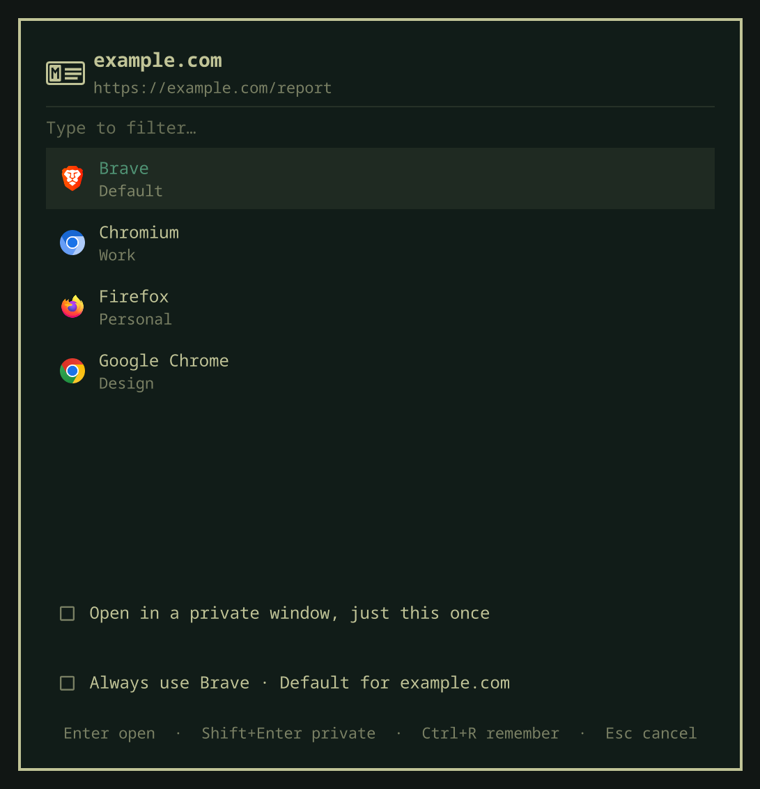

# mclovin — an Omarchy shell plugin

Choose which browser opens every link.


Click a link and mclovin puts a picker in the middle of the screen listing the
browsers you have installed — one row per profile, so "Chromium · Work" and
"Chromium · Personal" are separate choices. Pick one and the link opens there.
Tick *always use this browser* and the choice becomes a rule, so the next link
to that host skips the picker.

Rules are written in a form, not a config file: say whether a link **starts
with**, **contains**, or **is on** something, choose a browser and profile, and
watch the preview tell you what it would catch before you save it. When two
rules could take the same link the narrower one wins, so there is no ordering to
maintain.

<p align="center">
  
  
</p>
<p align="center">
  
</p>

Everything runs inside `omarchy-shell` as QML. There is no daemon, no compiled
binary, and no dependency on the [mclovin CLI](https://github.com/guilhermeyo/mclovin)
that shares the name — though it can import that CLI's rules if you have them.

## Requirements

- Omarchy Quattro (the Quickshell-based shell — `omarchy plugin list` should work)
- Nothing else

## Install

```bash
omarchy plugin add https://github.com/guilhermeyo/omarchy-mclovin.git --enable
```

That puts the bar widget on the right side of the bar. Click it, then click
**Make mclovin the default** to register mclovin as the system handler for
`http` and `https`.

Until you do that, the bar icon stays in the theme's urgent colour — links are
still opening, just not through mclovin.

## Using it

**The picker.** Any link that does not match a rule opens the picker.

It lists one row per **browser profile**, not per browser: three Chromium
profiles are three rows, and a browser with no profiles is a single row. Picking
"Chromium" when three profiles exist would just reopen whichever was last used,
which is not a choice.

```
 Brave            Default
 Chromium         Work
 Firefox          Personal
 Google Chrome    Design
```

| Key | Does |
|-----|------|
| type | filter across browser name, profile name, and desktop id |
| `↑` `↓` `Tab` | move |
| `Enter` | open the link in the highlighted browser and profile |
| `Shift+Enter` | open it in a **private window**, just this once |
| `Ctrl+P` | tick the private box without opening yet |
| `Ctrl+R` | toggle "always use <browser · profile> for <host>" |
| `Esc` | clear the filter, then cancel |

Typing `des` finds the Google Chrome profile named "Design". Cancelling
drops the link — nothing opens.

**Turning a link into a rule, without leaving the picker.** Under the list sit
two boxes, and the second one is a whole rule on one line:

```
☐  Private — just this once
☐  Always
```

Tick it and the line grows into the rule it will write:

```
☐  Private — just this once
☑  Always  Brave · Default · site  [ github.com ]   Site   Path   Contains
                                                    ‾‾‾‾
```

Until then none of that exists — no field, no shapes, no summary. Private and
Always are the two actions here; everything else is a detail of one of them and
only appears when it has something to say. The card shrinks to match, so the
unticked state is two checkboxes rather than two checkboxes and a hole.

The three shapes are not buttons either: caption-sized, all the width of the
longest label, no box and no fill, with a hairline under the active one.

The link you clicked was `https://github.com/acme/app/issues/1842`, but the rule
is never the URL you happened to open. It is the term in the field, matched the
way the chip says:

| Chip | Fills the field with | Matches |
|---|---|---|
| **Site** | `github.com` — the host, no `www.` | that site |
| **Path** | `https://github.com/acme/app` — origin plus the first couple of path segments, stopping at anything that looks like an id | that project |
| **Contains** | the host, for you to trim down to `github` | anywhere in the link |

The field is editable, so "everything GitHub goes to Brave" is one click and one
tick. The row reads as the rule that will exist, private included: tick both
boxes and it says `Always Brave · Default · private · site`.

No regex here — that lives in the form, which the picker deliberately does not
open. A picker is for choosing quickly.

Profiles come from the browser itself: Chromium-family from `Local State`,
Firefox from `Profile Groups/*.sqlite` (Firefox 143+) and `profiles.ini` before
that. The SQLite read shells out to `sqlite3`; without it installed you lose the
Firefox profile rows and nothing else.

**Rules.** Ticking the remember box in the picker writes a rule for that host.
Everything else happens in the rule form, which is the bar widget's drop-down →
**Add rule**, or the pencil on any rule in the list — the row itself opens it
too. The × next to it asks first, naming the rule in the question.

## Private windows

Two separate things, deliberately not the same control.

**Just this link.** `Shift+Enter` in the picker, or the *Private — just this
once* box above the remember line. Both reset every time the picker opens, so a
private link cannot leave the toggle armed for the next one.

**Always, for this site.** A rule can be private: *Open in a private window* in
the rule form. Every link it catches opens incognito, in that browser and
profile. The rule list marks it — `Firefox · Personal · private` on the second
line — so it is visible without opening anything.

Tick both in the picker and the remember line says so out loud —
`Always Firefox · Personal · private · site` — so nothing becomes a private rule
by accident.

The flags are each browser's own, read off the `[Desktop Action
new-private-window]` group in its installed desktop entry rather than guessed:

| Browser | Flag |
|---|---|
| Chromium, Chrome, Brave, Edge, Vivaldi | `--incognito` |
| Firefox and friends | `--private-window` |

Profile and private compose. On Firefox both are visible at once — a window
launched into a profile privately titles itself *"… — Personal — Mozilla
Firefox Private Browsing"*, which is how this was verified. Chromium's incognito
is per-profile by design, but its windows expose no state to read back, so that
family rests on the vendor's own flag rather than on a measurement.

A browser with no private flag is not offered one: the toggle greys out and says
so instead of opening an ordinary window and calling it private. Command rules
have no private option either — a command line already states how it wants to
launch, and appending `--incognito` to an arbitrary one would be a guess.

## The rule form

Three questions, in order, with the answer to the third visible while you
answer the first two.

**When a link…** picks how the rule matches:

| | Catches | Good for |
|---|---|---|
| **Starts with** | the link begins with this | one section of a site — `github.com/acme/` |
| **Contains** | the text appears anywhere | a word — `invoice` |
| **Host is** | the link is on exactly this site, www or not | `example.com` |
| **Regex** | a case-insensitive pattern | the rest |

Regex lives behind the **advanced** link in the corner, so it is one click away
rather than in the way. A rule opened for editing that already uses one expands
it for you.

**+ Add another** gives the rule a second term, a third, and so on. Any one of
them matching is enough, so `example.com` and `example.org` live in one rule instead of
two.

**Open it in…** is a browser — picked from the same browser·profile list the
picker shows, never a field you have to guess the spelling of — a command with
`{url}` in it, or the built-in **Zoom directly** target.

**Start from…** is a preset library above the form. **Custom rule** keeps the
ordinary editor defaults; **Zoom meeting → Zoom directly** fills the editable
form with a narrow rule for numbered Zoom meeting links and selects **Zoom
directly**. New presets are data-driven entries in `Router.js`, so the library
can grow without adding one-off controls to the form. The Zoom target changes
an ordinary `https://…zoom.us/j/…` link into `zoommtg://` before a browser opens. A native
Zoom installation can own that protocol; on stock Omarchy its registered
handler opens the meeting in a chromeless Zoom webapp. If the protocol cannot
launch, mclovin sends the original HTTPS link to the configured fallback
browser instead.

Links clicked inside a browser normally never reach the system HTTP handler — the
browser owns that navigation, and no XDG handler is ever asked. The optional
Chromium companion under `browser-companion/` closes that gap.

It catches links clicked on **any HTTP or HTTPS site** and hands them to mclovin,
which routes them through the same rules it applies to every other link. It asks
for access to all sites because the source could be any calendar, chat, email or
document, but its content script reads nothing until a trusted click lands on a
link, and then reads only that link's destination. It does not request history,
cookies, storage, or network access.

It does not watch every rule. Only the ones whose **destination leaves the
browser** — a web app, a built-in action, a command — because a link already
headed for the browser you are reading in should navigate the tab rather than
open a second one, and only the browser can do that. The native host serves those
matchers and nothing else: where a link ends up is decided on this side and never
travels into the browser.

To send a link the automatic path leaves alone, right-click it and choose **Open
link with mclovin**. That gesture is explicit, so it routes whatever was clicked —
a link no rule claims reaches the picker.

Once a rule with such a destination exists, the bar panel offers **Set up browser
companion**. The equivalent terminal command is:

```bash
./browser-companion/native/manage install
```

It installs the extension the same way Omarchy installs its own — `copy-url`,
`yt-dlp` and `whatsapp-slim` all arrive by being named on the browser's
`--load-extension` line in `~/.config/<browser>-flags.conf`, and mclovin's is
appended to that same list. An extension named on the command line installs as
`COMMAND_LINE` rather than unpacked, so this needs **no Chrome Web Store listing
and no Developer mode**, and Chromium does not prompt about it on every start.

The list is appended to, never rewritten, and `uninstall` removes only mclovin's
own path — Omarchy's extensions are on that line too. Flags are read once at
startup, so the browser has to be closed and opened again.

Loading `browser-companion/extension/` by hand from `chrome://extensions` with
Developer mode on works exactly the same, for a browser with no flags file or for
anyone who would rather not have their browser's command line edited.

The manager detects Chromium-family profiles already present under `~/.config`.
It also has `uninstall`, `status`, and `open` commands; a browser name such as
`chromium`, `chrome`, `brave`, `vivaldi`, or `edge` can be supplied when needed.
The extension reports a local id/version/timestamp handshake so the panel can
show **Ready**. If the bridge cannot be reached, the browser navigation is
restored instead of the click being dropped. Architecture, lifecycle, and release
details live in [`browser-companion/README.md`](browser-companion/README.md).

**Preview** is the part that makes the rest trustworthy:

- *"A link like https://github.com/acme/… would open in Chromium · Work."*
  Rewritten on every keystroke.
- A **Try a link…** box that says `matches` or `no match` against what you type.
  For regex rules this replaces the example, since there is no honest way to
  invent a URL from a pattern.
- A warning when **another rule is narrower and takes the link**, naming it and
  where it goes: *"“Contains github.com/acme” is narrower and takes
  this link — it opens in Chromium · Work."*

`Ctrl+Enter` saves, `Esc` cancels. You never see the config file.

## When two rules catch the same link

The narrower one wins. There is no order to manage.

"Narrower" is measured as how much of the link a rule pins down — essentially
the length of the text it constrains, with a point of credit for being anchored:

| Matcher | Counts as |
|---|---|
| `Host is` | length of the host, +1 for being exact rather than a substring |
| `Starts with` | length of the prefix, +1 for being anchored |
| `Contains` | length of the text |
| `Regex` | its literal characters only — metacharacters describe what a pattern *accepts*, not what it pins down |

So `Contains github.com/acme` (15) beats `Contains github.com` (10)
without anyone dragging anything, which is the case that actually comes up.

Ranking by matcher kind instead would get that backwards: `Host is github.com`
constrains ten characters, while a `Contains` rule naming an organisation inside
that host constrains twenty-four and is plainly the more specific rule.

A rule with several terms is only as narrow as its widest one, since any of them
can match. Exact ties keep the order the rules were written in.

The list is shown and stored narrowest-first, which is the order they are tried,
so the panel and the file always read the same way.

**Opening a browser with no link.** Right-click the bar icon, or use the
drop-down's **Open the picker**. Same window, no URL, picks just launch the
browser.

## Configuration

Rules live in `~/.config/omarchy-mclovin/config.json`. The plugin watches the
file, so editing it by hand takes effect immediately.

The form writes this for you; it is documented because the file is yours and
editing it by hand still works — the plugin watches it and reloads.

```json
{
  "version": 1,
  "fallback": "",
  "webapp": "",
  "rules": [
    { "when": "startsWith", "terms": ["github.com/acme"], "browser": "chromium", "profile": "Work" },
    { "when": "host", "terms": ["example.com", "example.org"], "browser": "firefox" },
    { "when": "regex", "terms": ["^https://([a-z0-9-]+\\.)*zoom\\.us/(j|w|wc/join)/[0-9-]+(?:[/?#]|$)"], "action": "zoom" },
    { "when": "host", "terms": ["hedge.example"], "browser": "firefox", "profile": "Personal", "private": true },
    { "when": "regex", "terms": ["^https?://(\\w+)\\.internal\\."], "browser": "chromium" }
  ]
}
```

Matchers, narrowest rule wins:

- `when` — `startsWith`, `contains`, `host`, or `regex`.
- `terms` — one or more; any of them matching is enough.

The older shape (`match` as a string or array, `matchRegex` for patterns) is
still read and is migrated to the above the next time anything is saved.

Targets, one per rule:

- `action` — a built-in destination. `zoom` converts numbered Zoom meeting
  links to `zoommtg://` and falls back to the original HTTPS link when needed.
- `browser` — a desktop entry id, with or without the `.desktop` suffix.
- `profile` — optional, alongside `browser`. Name it the way the browser's
  profile switcher does ("Work", not "Profile 3"); mclovin resolves the mapping
  itself. Chromium-family gets `--profile-directory`, Firefox gets `--profile`
  with the profile's path, or `-P` for the older named profiles.
- `private` — optional, alongside `browser`. Opens every link the rule catches
  in a private window. Not available next to `command`.
- `command` — a raw command line with `{url}` where the link goes, for anything
  that is not a plain browser.

And two settings:

- `fallback` — a browser to use when nothing matches, instead of showing the
  picker. Leave it empty to always ask.
- `webapp` — which browser gets `--app=` windows from `omarchy-launch-webapp`.
  Falls back to `fallback`, then to the first browser found. Webapps never open
  the picker. No screen writes this one yet: it is the one setting you have to
  put in the file yourself.

## Importing from the mclovin CLI

If you have the [mclovin CLI](https://github.com/guilhermeyo/mclovin) with rules
in `~/.config/mclovin/rules.toml`, the drop-down offers **Import N rules from
the mclovin CLI**. It reads the TOML and resolves browser names to desktop entry
ids. Profiles and `command =` rules come across intact.

The CLI is first-match-wins and this plugin is narrowest-wins, so the imported
rules get re-ranked rather than keeping their file positions. For the ordering
people actually write — the specific rule above the general one — that lands on
the same answer. A pair where the *wider* rule was deliberately first is the
exception, and the form's preview will show it opening somewhere new.

It is a one-shot copy, not a live binding. After importing, this plugin owns its
config and the CLI can go away.

Two things do not come across:

- **`rewrite` rules** are skipped. This plugin dispatches URLs, it does not
  transform them, and importing the match without the rewrite would send the
  right link to the right browser with the wrong address.
- **`fallback_browser`** is not imported. In the CLI it is an emergency backstop
  used only when the picker cannot open; here the same word means "route there
  instead of asking". Copying it would silently switch the picker off.

The offer disappears once there is nothing left to take.

Today's counters live in `~/.cache/omarchy-mclovin/stats.json` and reset at
midnight.

The bar widget has one setting, `showCount`, which puts today's link count next
to the icon. Set it in `~/.config/omarchy/shell.json` on the widget's entry.

## IPC

One target, named after the plugin id.

```bash
ID=io.github.guilhermeyo.mclovin

omarchy-shell $ID open https://example.com   # route a URL
omarchy-shell $ID status                     # JSON: handler, browsers, profiles, rules
omarchy-shell $ID refresh                    # re-read browsers and the default handler
omarchy-shell $ID importRules                # import from the CLI's rules.toml
omarchy-shell $ID becomeDefault              # register as the http/https handler
omarchy-shell $ID restoreDefault firefox     # hand the handler back to a real browser
omarchy-shell $ID setupBrowserCompanion      # register/open the optional Chromium companion
omarchy-shell $ID refreshBrowserCompanion    # refresh companion status in the panel
omarchy-shell $ID togglePanel                # open the bar drop-down (bind a key to this)
```

The handler lives on the service rather than on the panel, which is where every
other plugin puts it, because it has to answer whether or not the bar widget is
on the bar. For the same reason the panel calls are `togglePanel` / `showPanel`
/ `hidePanel` rather than the usual `toggle` / `show` / `hide`: `open` on this
plugin means "open this link" and takes a URL, and that is the one call the
desktop entry depends on.

`open` answers `routed` when a rule took it, `asked` when the picker went up,
and `failed` when neither worked.

## How it hooks into the system

XDG requires an *executable on disk* to be the registered handler for
`x-scheme-handler/http`, and `omarchy-shell` is a process that is already
running — it cannot be the `Exec=` target. So **Make mclovin the default** writes
one desktop entry:

```
~/.local/share/applications/io.github.guilhermeyo.mclovin.desktop
```

pointing at `mclovin-open`, a shell shim in this repo whose main job is to hand
the URL to the shell over IPC. It also owns fallback launching and built-in
targets that must observe whether an external protocol handler succeeds. The
plugin then runs `xdg-mime default` for both schemes.

If the shell is not running when a link is clicked, the script falls back to
launching your configured `fallback` browser directly, and failing that, the
first installed browser it finds. A link is never silently swallowed.

### Webapps

`omarchy-launch-webapp` calls the default browser as `<browser> --app=URL`, but
only for browsers on a hard-coded whitelist — anything else it silently replaces
with `chromium.desktop`. mclovin's id is not on that list.

So installing mclovin and making it the default moves your webapps to Chromium,
even though nothing about your webapps changed. That is worth knowing before you
switch: it is the one thing this plugin quietly takes away.

`mclovin-webapp-fix` gives them back, by adding `*mclovin*` to that whitelist:

```bash
~/.config/omarchy/plugins/io.github.guilhermeyo.mclovin/mclovin-webapp-fix
```

Webapps then go through mclovin, which sends them to the `webapp` browser from
your config without ever showing the picker. It is idempotent, keeps a
`.before-mclovin.bak` next to the script it edits, and `--revert` undoes it.

The pattern is a glob rather than the plugin's id because a pattern pinned to
one id dies silently the day the id changes — which is exactly what happened to
the mclovin CLI's version of this patch, and why `--check` exists.

Run `--check` when webapps still land in the wrong browser. It deliberately does
not ask whether the patch is present; it runs your real default handler id
against the real pattern, resolves the handler binary, and confirms the `webapp`
browser is installed and understands `--app=`:

```
$ mclovin-webapp-fix --check
✔ Whitelist: omarchy-launch-webapp accepts mclovin
✔ Default handler: io.github.guilhermeyo.mclovin.desktop matches the whitelist
✔ Handler binary: …/io.github.guilhermeyo.mclovin/mclovin-open
✔ Web app browser: brave-browser (brave)
```

Two caveats, both unavoidable, both stated because this edits a file the plugin
does not own.

Whether you can write it depends on how Omarchy was installed: a checkout under
`$HOME` is yours, a packaged one under `/usr` belongs to the package manager.
The script refuses with an explanation instead of a bare permission error.

And `omarchy update` runs `git pull --ff-only`, which restores the original
line. Install the hook to re-apply after every update:

```bash
install -Dm755 \
  ~/.config/omarchy/plugins/io.github.guilhermeyo.mclovin/hooks/mclovin-webapp-fix.hook \
  ~/.config/omarchy/hooks/post-update.d/mclovin-webapp-fix.hook
```

That same `pull --ff-only` is the price of a modified tracked file: when
upstream edits `omarchy-launch-webapp` itself, the pull aborts and the update
stops there. Nothing is lost and nothing is silent — run `mclovin-webapp-fix
--revert`, update, and the hook re-applies. There is no pre-update hook that
would avoid it.

## Uninstall

```bash
./browser-companion/native/manage uninstall
omarchy plugin remove io.github.guilhermeyo.mclovin
```

Remove the Chromium extension from `chrome://extensions` as well if the
companion was installed. The manager command removes only mclovin's native-host
manifests and local connection status; it does not modify unrelated browser
configuration.

Point the system at a real browser again first, otherwise links have no handler:

```bash
omarchy-shell io.github.guilhermeyo.mclovin restoreDefault firefox
# or, once it is gone:
xdg-mime default firefox.desktop x-scheme-handler/http x-scheme-handler/https
rm ~/.local/share/applications/io.github.guilhermeyo.mclovin.desktop
```

Your rules in `~/.config/omarchy-mclovin/` are left alone.

## Going to a browser that is already open

Picking a browser with no link in hand means "take me there". If that browser
and profile already has an ordinary window, mclovin raises it instead of
stacking a second one on top. Picking privately always opens: a fresh private
window is the point of asking.

Windows come from the Wayland foreign-toplevel protocol rather than from a
compositor query, so recognising them needs no `hyprctl`. A `--app=` window
reports an id like `brave-web.whatsapp.com__-Default`, and that doubled
underscore is what keeps a web app from ever counting as the browser being open.

Raising one does take `hyprctl`. The protocol's own `activate()` lands while
the picker is up, because the shell holds the keyboard at that moment, and does
nothing when a rule fires with no overlay on screen. So both are sent: the
protocol first, then the dispatcher, in the two dialects a Lua config and a
classic config speak.

Two limits worth stating plainly, because both fail towards opening a window
rather than towards the wrong one:

- **Chromium-family windows do not say which profile they show.** With one
  profile every ordinary window is that profile and raising it is safe. With
  several there is nothing to match on, so mclovin launches instead of
  guessing. An incognito window is likewise indistinguishable from an ordinary
  one, so on a single-profile browser it can be the window that gets raised.
- **Firefox does say**, in its title, so its profiles are told apart — and a
  private window is skipped, in any language, by requiring the brand segment to
  be exactly "Mozilla Firefox" rather than matching English wording.

## Sending a link to a web app

A rule can name an Omarchy web app instead of a browser — the third choice under
**Open it in…** in the rule form. Links it catches land in the window that app
already has open, and open one when it has none.

This exists for WhatsApp, and for anything else that allows one session at a
time. WhatsApp Web logs the open window out the moment a second one claims the
session, so a share link that opened a second window did not merely duplicate
the app, it broke the app that was already there.

```json
{ "when": "contains", "terms": ["whatsapp.com", "wa.me"], "webapp": "WhatsApp" }
```

The web app is matched by site, not by exact URL: the app sits on
`web.whatsapp.com/` and the share link that wants it is on
`api.whatsapp.com/send`. A `--app=` window cannot be navigated from outside, so
the choice is that window or another one, and the open one wins.

Nothing routes to a web app on its own. Without a rule the picker behaves
exactly as before — web apps are never offered as rows.

## Notes

- The picker lists every installed application that declares the `WebBrowser`
  desktop category. If you also have the mclovin CLI installed, it declares that
  category too and will appear in the list — routing to it hands the link to a
  second router rather than to a browser.
- Browsers are read from the shell's desktop entry index, so one installed
  mid-session shows up without a restart.

## Credits

The browser companion is [@jondkinney](https://github.com/jondkinney)'s idea, and
his first working version of it landed in
[#3](https://github.com/guilhermeyo/omarchy-mclovin/pull/3), along with the
data-driven preset library the rule form uses.

That first one caught Zoom meeting links. It is worth saying what it actually
was: mclovin is an XDG handler, so it gets every link the *system* is asked to
open and nothing else, and a link clicked inside a browser had been written off
here as permanently out of reach. That was true — the browser owns that
navigation, and no handler is ever consulted. Catching the click in the page is
the one place the decision still exists. Zoom was the first passenger; every rule
rides it now.

## Licence

MIT. See [LICENSE](LICENSE).
